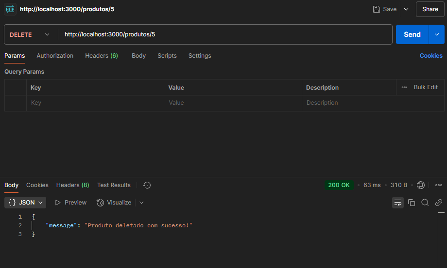

# SISTEMA DE GERENCIAMENTO DE PRODUTOS E USUÁRIOS

## INTRODUÇÃO
Este projeto foi desenvolvido para atender à demanda de uma empresa que precisava de um sistema simples e eficaz para gerenciar produtos e usuários. O objetivo era criar uma aplicação onde os administradores pudessem facilmente cadastrar, atualizar, visualizar e excluir produtos e usuários. Para isso, optamos pelo padrão de arquitetura MVC (Model-View-Controller), que ajuda a manter a aplicação organizada e facilita futuras manutenções e expansões.  
A plataforma foi construída com Node.js e Express, e o MySQL foi escolhido para gerenciar o banco de dados. O sistema é dividido em dois módulos principais: Cadastro de Produtos e Cadastro de Usuários. Para garantir que as informações fossem inseridas de forma correta, implementamos validações rigorosas, como a checagem do nome do produto, preço e quantidade de estoque.  
Além disso, todos os endpoints da API foram testados e documentados no Postman, garantindo que as operações de CRUD (Create, Read, Update, Delete) funcionassem de maneira eficiente.

## ESTRUTURA DO MVC E SUAS MÚLTIPLAS FORMAS DE UTILIZAÇÃO
A arquitetura MVC foi escolhida para essa aplicação por permitir uma separação clara das responsabilidades, o que facilita o desenvolvimento e manutenção. A aplicação é dividida em três partes principais:

- **MODEL (MODELO):** O Model é o responsável por interagir com o banco de dados, realizando ações como inserção, atualização e recuperação de dados. No nosso sistema, temos arquivos como `conexao.js`, que gerencia a conexão com o MySQL, e `productModel.js` e `userModel.js`, que contêm as funções que manipulam os dados dos produtos e usuários.
  
- **VIEW (VISÃO):** A View é responsável apenas pela exibição dos dados ao usuário. Ela não contém lógica de negócios, apenas a parte visual da aplicação. No nosso caso, as Views são os arquivos `.ejs` na pasta `views`, como `produtoCadastro.ejs` e `userCadastro.ejs`, que exibem os formulários de cadastro para os usuários.
  
- **CONTROLLER (CONTROLADOR):** O Controller é o "intermediário" entre o Model e a View. Ele recebe as requisições do usuário, processa as informações com o auxílio do Model e, então, decide qual View será apresentada. Os Controllers no sistema estão localizados na pasta `controllers`, e arquivos como `ProdutoController.js` e `UserController.js` são responsáveis pela lógica de manipulação de dados.

A grande vantagem do MVC é a flexibilidade. Se quisermos adicionar uma nova funcionalidade, como "Visualizar Produto", só precisaremos alterar a View, sem mexer na lógica do Controller ou na estrutura do banco de dados. E se decidirmos mudar a forma como os dados são armazenados, por exemplo, para um banco de dados diferente, isso pode ser feito diretamente no Model, sem impactar o restante da aplicação.

## FUNCIONALIDADES IMPLEMENTADAS
O sistema foi projetado para permitir o gerenciamento de produtos e usuários. Com ele, é possível adicionar novos produtos e usuários, atualizar informações existentes, listar os dados cadastrados e excluir registros. Cada uma dessas operações é realizada de forma eficiente, seguindo o padrão de arquitetura MVC, o que garante uma boa separação de responsabilidades e facilita a manutenção da aplicação.

### **PARA OS PRODUTOS:**
- **Cadastrar produto:** O administrador pode cadastrar um novo produto, informando nome, preço e quantidade em estoque. Antes de salvar os dados no banco de dados, o sistema faz validações.
- **Atualizar Produto:** Os dados de um produto já cadastrado podem ser atualizados, como o nome, preço ou quantidade.
- **Listar Produtos:** Todos os produtos cadastrados são exibidos em uma lista com nome, preço e quantidade.
- **Excluir Produto:** Produtos podem ser removidos do sistema quando necessário.

### **PARA OS USUÁRIOS:**
- **Cadastrar usuário:** É possível cadastrar um novo usuário fornecendo nome, email e senha. A aplicação valida esses campos antes de registrar no banco.
- **Atualizar Usuário:** Usuários podem atualizar seus dados, como nome, email ou senha, após fazer login.
- **Listar Usuários:** A lista de usuários cadastrados também pode ser visualizada de forma simples.
- **Excluir Usuário:** Usuários podem ser excluídos quando necessário.

Todas essas funcionalidades são acessíveis via endpoints da API, e cada uma foi testada no Postman para garantir que estão funcionando corretamente.

## VALIDAÇÃO DE CAMPOS
As validações no sistema garantem que os dados inseridos sejam corretos:
- **Cadastro de Produtos:** O sistema verifica se o nome do produto tem pelo menos 3 caracteres, se o preço é positivo e se a quantidade em estoque não é negativa.
- **Cadastro de Usuários:** Durante o cadastro de novos usuários, o sistema exige que o nome, email e senha sejam fornecidos. O email é validado para garantir que seja único.

## TESTES REALIZADOS COM O POSTMAN
Durante o desenvolvimento da aplicação, todos os endpoints foram testados no Postman. Abaixo estão os testes realizados:

### **PRODUTOS:**
- **GET**

- **GET{}**

- **POST**

- **PUT**

- **DELETE**

### **USUÁRIOS:**
- **GET**

- **GET{}**

- **POST**

- **PUT**

- **DELETE**

## DIFICULDADES
- **Configuração do Banco de Dados:** A configuração do banco de dados levou algum tempo para ser ajustada corretamente, principalmente no que se refere à criação das tabelas e ao ajuste da string de conexão.
- **Validação de Dados:** A validação dos dados no backend para garantir que os campos obrigatórios fossem inseridos corretamente no banco de dados foi uma tarefa que exigiu atenção, especialmente com a lógica de validação de campos.

## CONCLUSÃO
Este sistema de gerenciamento de produtos e usuários foi implementado com sucesso utilizando o padrão MVC e banco de dados MySQL. Todos os endpoints CRUD foram desenvolvidos e testados com o Postman, garantindo que a aplicação estivesse funcionando corretamente. O sistema facilita a inserção, listagem, atualização e exclusão de dados de usuários e produtos, sendo eficiente para o gerenciamento desses dados.
